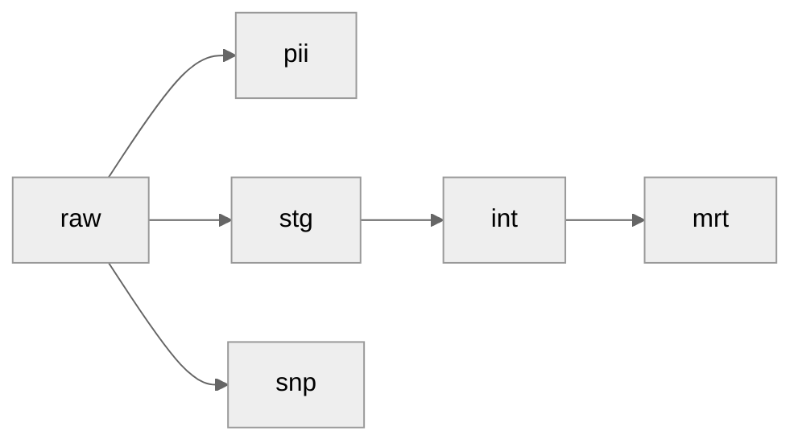

# Getting Started
## What is dbt
>dbt (data build tool) is an open-source tool that empowers data analysts and engineers to transform data within their data warehouses by writing and executing SQL code. It focuses on the "transform" part of the ETL (Extract, Load, Transform) process, allowing users to define, test, and deploy data transformations using SQL. Essentially, dbt enables teams to build and manage their data models in a collaborative, version-controlled, and testable way, ensuring data quality and reliability.

## dbt Learning Material
[dbt Fundamentals](https://learn.getdbt.com/learn/course/dbt-fundamentals/)
<br>[dbt Certified Developer](https://learn.getdbt.com/learn/learning-path/dbt-certified-developer)

# Contributing
Create a feature branch based off the `develop` branch.
<br>`feat/feature_name`
<br>Your branch name should be all lowercase, terse, and descriptive:
<br>`feat/adding_model_dim_product`

Once your changes are complete, submit a pull request to merge the changes into the develop branch, where it will be reviewed by your peers, and feedback will be provided.  Once approved it will be merged into the develop branch, and will be put into production on the next deployment.

# Project Structure

## Naming Conventions
`type`_`schema`__`model_name`.sql

Proper naming of models is important, as the file names are used to determine the schema and table names that are used to materialize the model on the warehouse.  It is also used to understand upstream and downstream dependencies within the orchestration tool.

### Types
 * **stg:** Staged tables, that have had light transformations applied to be standardized in the warehouse, but generally are very close to the raw data.
 - **int:**  Intermediate models that are used in service to apply common transformations that will be used by dims and facts.
 * **dim:** Dimension models.
 - **fct:** Fact models which provide measures.

## Models
Models are sql or python code used to define a table to be materialized on the warehouse.  By defining a model using a select statement, dbt will handel the dml and ddl needed to create, and refresh the model.

Models are organized into three folders: `staging`, `intermediate`, `marts`, as well as  two special kinds of materializations called `snapshots` and `seeds`.



### staging
Staging is a silver layer where raw data is made ready for general use.

 Models are organized by the source system they originate from.  Standardization happens at this layer:
- All timestamp columns are converted to utc
- Columns are renamed to be more explicit in what they represent, for example, a column named 'id' would be renamed to 'product_id' so it is easy to understand what it represents downstream.
- data cleaning is applied, such as deduplication, or filtering of invalid records, for example, bot traffic is removed from website click data.
- conversions are applied to standardize, for example if a source uses integers to represent monetary values, it should be converted to a decimal type.
- PII data is anonymized / pseudo-anonymized and split off from non-pii data.  Vertical partitioning.
- Light normalization and denormalization where it makes sense for example pre-joining tables with one to one cardinality, or converting a business key to a more usable key.

Raw tables are also defined in the staging zone through a `__sources.yml` file, however they will be materialized upstream of dbt.

### intermediate
Intermediate is the layer between staging and marts, where common data transformations are applied so that code can be reused by multiple downstream tables.

Models are organized by the primary mart that they intend to supply data to.  Models with general use cases across marts are put into a common grouping.

### marts
Marts are the gold layer where models are groups by business unit.  These models are primarily in service of a semantic layer, and general BI.  Data modeling best practices are followed (dimensional, cube, data vault, kimball, etc.) so that they can be queried easily and efficiently by business users.

Models are organized by the business domain in which they serve.

### snapshots
Snapshots are used to capture the state of a table at a point in time.  Each time a snapshot is run, any records that have changed will have a new record inserted, the old version of the record will be marked as inactive, and will have a time period of when it was active from, and to.  This is commonly referred to as Slowly Changing Dimension Type Two (SCD2).

### seeds
Seeds are CSV files that will be materialized as tables on the warehouse.  These are used for small datasets that do not contain sensitive information, and do not change often.  For example, a reference table maintained by the business that would not warrant a heavy pipeline to maintain.

## Macros
DBT utilizes jinja macros to programmatically inject values into your sql at run time.  By using macros you can apply powerful programmatic patterns that are not otherwise possible in normal sql.

# Dagster Specific Config
A meta key has been introduced to extend the functionality of dbt in dagster.  It is used to define automation's, checks, and partitions for finer control on how and when assets are materialized.

*Example config block:* 
``` jinja
{{-
  config(
    materialized = "incremental",
    incremental_strategy = "delete+insert",
    unique_key = "id",
    meta = {
      "dagster":{
        "partition": "daily",
        "partition_start_date": "2025-07-01",
        "automation_condition": "on_cron_no_deps",
        "automation_condition_config": {
          "cron_schedule":"@daily",
          "cron_timezone":"utc"
        },
        "freshness_check": {
          "lower_bound_delta_seconds": 18000,
          "deadline_cron": "0 0 * * *",
          "severity": "WARN"
        }
      }
    }
  )
-}}
```
## Partition Definitions
When specified dagster will automatically create a partition for a given time span, allowing for incremental loading and backfills.  Typically an incremental materialization strategy is used, with a special jinja incremental macro that will accept time ranges from dagster.  See *jinja* below.

### partition
When specified dagster will automatically create a partition for a given time span, allowing for incremental loading and backfills.

*Accepted values:* `hourly` `daily` `weekly` `monthly`

### partition_start_date
When a partition is specified, you must also define the earliest time available in the upstream dependency.  This is given in ISO format:

*Accepted values:* `YYYY-mm-dd` `YYYY-mm-dd HH:mm:ss`

### Jinja
When a partition is defined, a jinja macro is used to allow dagster to insert the time range of the backfill at runtime.  This is similar to the typical is_incremental pattern, but uses `var("min_date)` and `var("max_date")`.
``` jinja

  where 1=1 
    and hit_at >= '{{ var("min_date") }}'
    and hit_at <= '{{ var("max_date") }}'

```

## Asset Checks
### freshness_check
### cron_deadline
Provide a deadline for when it is expected the asset to be available.  Required for partitioned modeles.

*Accepted values:* `str` cron expression.

### lower_bound_delta_seconds
Provide a delta for when it is expected the asset to be refreshed since last materialization, or cron deadline.

*Accepted values:* `float` seconds since last successful materialization, or cron deadline

### severity
Define the severity of the check in the case of failure.

*Accepted values:* `WARN` `ERROR`


## Declarative Automation Definitions
Instead of using fixed schedules, declarative automation is used.  With this methodology, the model will be aware of upstream assets, and will materialize as soon as it is able given the condition set.
### automation_condition
Set under what conditions the asset should be materialized.  When the condition requires additional configuration, automation_condition_config is used.

accepted_values:
`manual` `on_cron_no_deps` `eager` `missing_or_changed`
`lazy` `lazy_on_cron` `eager_with_deps_checks` `...`

Reference: *elt_core/defs/automation_conditions.py*

### automation_condition_config
Some automation conditions require configuration, when this is the case, the configuration will be passed through this argument.

accepted_values: `list` `dict`

Reference: *elt_core/defs/automation_conditions.py*

### Available Automation Conditions:


- **eager:**
Will materialize every time an upstream dependency is materialized.
- **eager_with_deps_checks:**
Will materialize when any upstream dependency refreshes, but only after the upstream asset passes its quality checks.
- **lazy:**
Will materialize only when upstream assets require it.
- **lazy_on_cron:**
Will materialize only when upstream assets require it, but only once per cron schedule.
- **missing_or_changed:**
Will materialize when the code has changed since the last run.
- **manual:**
Asset will only materialize from a manual run in dagster.
- **on_cron_no_deps:**
Will materialize on the cron schedule regardless of the state of upstream assets.

additional conditions will be added over time, for the most up to date list, reference: *elt_core/defs/automation_conditions.py* 